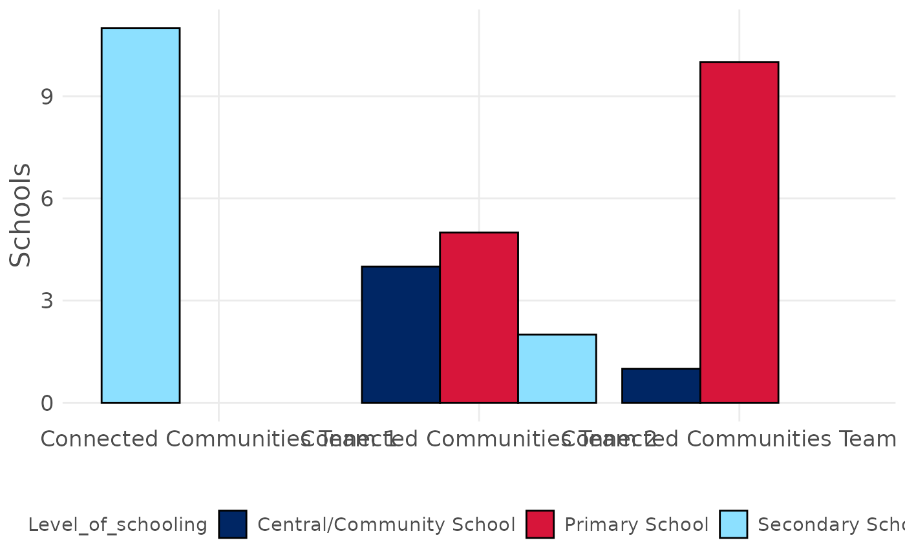
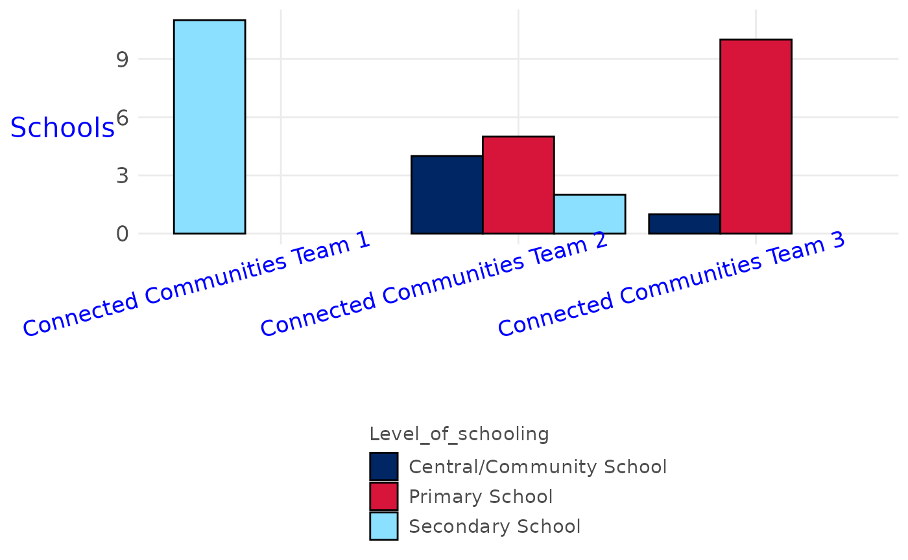

# Extending theme_doe

This vignette provides examples of customising plot output using
[`theme_doe()`](https://nsw-education.github.io/doestyle/reference/theme_doe.md).

## Setup

``` r

library(doestyle)
library(dplyr)
library(ggplot2)
library(stringr)
```

## Examples

`doestyle` includes an example dataset: \[public_schools\], the NSW
Public Schools Master dataset.

``` r

head(public_schools)
#> # A tibble: 6 × 45
#>   School_code AgeID School_name   Street Town_suburb Postcode Phone School_Email
#>   <chr>       <chr> <chr>         <chr>  <chr>       <chr>    <chr> <chr>       
#> 1 5423        NA    John Brotchi… 1361 … Botany      2019     9316… johnbrotch-…
#> 2 8600        86659 Secondary Co… Level… Parramatta  2150     02 7… SCLanguages…
#> 3 8473        46360 Chifley Coll… 67 No… MOUNT DRUI… 2770     9625… chifcolsnr-…
#> 4 8325        46407 Moree Second… Alber… Moree       2400     6752… mscalberts-…
#> 5 8870        46426 St Marys Sen… Kalan… St Marys    2760     9623… stmaryssen-…
#> 6 8374        46489 Brisbane Wat… 25 ED… WOY WOY     2256     4341… woywoy-h.sc…
#> # ℹ 37 more variables: Website <chr>, Fax <chr>,
#> #   latest_year_enrolment_FTE <dbl>, Indigenous_pct <dbl>, LBOTE_pct <dbl>,
#> #   ICSEA_value <dbl>, Level_of_schooling <chr>, Selective_school <chr>,
#> #   Opportunity_class <chr>, School_specialty_type <chr>, School_subtype <chr>,
#> #   Support_classes <lgl>, Preschool_ind <chr>, Distance_education <chr>,
#> #   Intensive_english_centre <chr>, School_gender <chr>,
#> #   Late_opening_school <chr>, Date_1st_teacher <date>, LGA <chr>, …
```

Typical use of
[`theme_doe()`](https://nsw-education.github.io/doestyle/reference/theme_doe.md)
and
[`scale_fill_doe()`](https://nsw-education.github.io/doestyle/reference/scale_fill_doe.md):

``` r

public_schools |>
  filter(str_detect(Principal_network, "Connected Communities")) |>
  ggplot(aes(x = Principal_network, fill = Level_of_schooling)) +
  geom_bar(colour = "black", position = position_dodge(preserve = "single")) +
  theme_doe(base_family = "sans") +
  labs(y = "Schools", x = "") +
  scale_fill_doe()
```



Modify angle and colour of axis text, and orientation of legend, by
adding arguments to the call to
[`theme_doe()`](https://nsw-education.github.io/doestyle/reference/theme_doe.md).
See
[`ggplot2::theme()`](https://ggplot2.tidyverse.org/reference/theme.html)
for a complete list of arguments that can be passed to
[`theme_doe()`](https://nsw-education.github.io/doestyle/reference/theme_doe.md).

``` r

public_schools |>
  filter(str_detect(Principal_network, "Connected Communities")) |>
  ggplot(aes(x = Principal_network, fill = Level_of_schooling)) +
  geom_bar(colour = "black", position = position_dodge(preserve = "single")) +
  theme_doe(base_family = "sans",
            axis.text.x = element_text(color = 'blue', 
                                       angle = 15, # add angle to x-axis labels
                                       hjust = 0.75,
                                       vjust = 1), 
            axis.title.y = element_text(color = 'blue',
                                        angle = 0), # rotate y-axis title
            legend.direction = "vertical") + # stack legend text vertically
  labs(y = "Schools", x = "") +
  scale_fill_doe()
```


